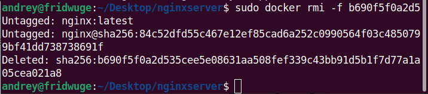
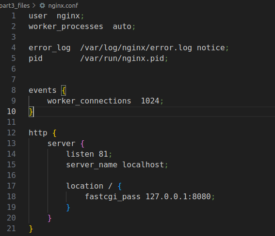
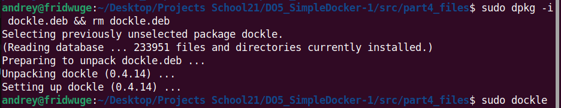

# Part 1. Готовый докер
## Возьми официальный докер образ с nginx и выкачай его при помощи docker pull
- __Прописываем в терминал команду sudo docker run nginx__
    
    
## Проверь наличие докер образа через docker images
- __Прописываем в терминал команду sudo docker images__
    
    

## Запусти докер образ через docker run -d [image_id|repository]
- __Прописываем в терминал команду sudo docker run -d nginx__
    
    

## Проверь, что образ запустился через docker ps
- __Прописываем в терминал команду sudo docker ps__
    
    

## Посмотри информацию о контейнере через docker inspect [container_id|container_name]
- __Прописываем в терминал команду sudo docker inspect 3e9513542fac__
    
    

## По выводу команды определи и помести в отчёт размер контейнера, список замапленных портов и ip контейнера
- __Получаем размер контейнера командой sudo docker inspect 3e9513542fac | grep "Size"__
    
    
- __Получаем список замапленных портов командой sudo docker inspect 3e9513542fac | grep Ports -A2__
    
    
- __Получаем ip контейнера командой sudo docker inspect 3e9513542fac | grep IPAddress__
    
    

## Останови докер образ через docker stop [container_id|container_name]
- __Прописываем в терминал команду sudo docker stop 3e9513542fac__
    
    

## Проверь, что образ остановился через docker ps
- __Прописываем в терминал команду sudo docker ps__
    
    

## Запусти докер с портами 80 и 443 в контейнере, замапленными на такие же порты на локальной машине, через команду run
- __Прописываем в терминал команду sudo docker run -d -p 80:80 -p 443:80 b690f5f0a2d5 и проверяем командой sudo docker ps__
    
    

## Проверь, что в браузере по адресу localhost:80 доступна стартовая страница nginx
- __Стартовая страница nginx__
    
    

## Перезапусти докер контейнер через docker restart [container_id|container_name]
- __Прописываем в терминал команду sudo docker restart f05d610afa3d__
    
    

## Проверь любым способом, что контейнер запустился
- __Прописываем в терминал команду sudo docker ps__
    
    

# Part 2. Операции с контейнером
## Прочитай конфигурационный файл nginx.conf внутри докер контейнера через команду exec
- __Прописываем в терминал команду sudo docker exec -it [CONTAINER ID] cat /etc/nginx/nginx.conf__
    
    

## Создай на локальной машине файл nginx.conf
- __Прописываем в терминал команду touch nginx.conf__
    
    

## Настрой в нем по пути /status отдачу страницы статуса сервера nginx
- __В созданный файл nginx.conf добавил дополнительные настройки__
    
    

## Скопируй созданный файл nginx.conf внутрь докер образа через команду docker cp
- __Прописываем в терминал команду sudo docker cp nginx.conf [CONTAINER ID]:/etc/nginx/nginx.conf__
    
    

## Перезапусти nginx внутри докер образа через команду exec
- __Прописываем в терминал команду sudo docker exec [CONTAINER ID] nginx -s reload__
    
    

## Проверь, что по адресу localhost:80/status отдается страничка со статусом сервера nginx
- __Прописываем в терминал команду sudo docker exec -it [CONTAINER ID] curl localhost:80/status__
    
    

## Экспортируй контейнер в файл container.tar через команду export
- __Прописываем в терминал команду sudo docker export [CONTAINER ID] > container.tar__
    
    

## Останови контейнер
- __Прописываем в терминал команду sudo docker stop 54389a3c7f39__
    
    

## Удали образ через docker rmi [image_id|repository], не удаляя перед этим контейнеры
- __Прописываем в терминал команду sudo docker rmi -f b690f5f0a2d5__
    
    

## Удали остановленный контейнер
- __Прописываем в терминал команду sudo docker rm 54389a3c7f39__
    
    

## Импортируй контейнер обратно через команду import
- __Прописываем в терминал команду cat container.tar | sudo docker import -c "ENTRYPOINT service nginx start && /bin/bash" - nginx_test__
    
    

## Запусти импортированный контейнер
- __Прописываем в терминал команду sudo docker run -dit -p 80:80 nginx_test__
    
    

## Проверь, что по адресу localhost:80/status отдается страничка со статусом сервера nginx
- __Прописываем в терминал команду curl http://localhost:80/status__
    
    

- __Это страничка в браузере, для убедительности__
    
    

# Part 3. Мини веб-сервер
## Напиши мини-сервер на C и FastCgi, который будет возвращать простейшую страничку с надписью Hello World!
- __Создаём файл main.c и вписываем следующий скрипт__
    
    

- __Запускаем Docker контейнер следующей командой в терминале__
    
    

- __Копируем файлы следующей командой в терминале в сам DockerContainer__
    
    

- __Прописывает по порядку следующие команды для правильной компиляции нашего файла__
    > apt-get update
    >
    > apt-get install -y gcc
    >
    > apt-get install -y libfcgi-dev

- __Компилируем программу следующей командой в терминале gcc -o server part3_files/main.c -lfcgi__

## Запусти написанный мини-сервер через spawn-fcgi на порту 8080
- __Если используем API, предоставляемую заголовком <fcgiapp.h>__
    > После компиляции двоичный файл можно выполнить напрямую, без использования spawn-fcgi или cgi-fcgi.

- __Если не используем API, предоставляемую заголовком <fcgiapp.h>__
    > Прописываем в терминал команду sudo spawn-fcgi -p 8080 -n server

## Напиши свой nginx.conf, который будет проксировать все запросы с 81 порта на 127.0.0.1:8080
- __Создаём наш файл и копируем его в контейнер вместе с файлом main.c__
    
    

## Проверь, что в браузере по localhost:81 отдается написанная тобой страничка.
- __Запускаем наш сервер командой: /bin/sh -c "nginx -g 'daemon off;' & /server"__
    
    

## Положи файл nginx.conf по пути ./nginx/nginx.conf (это понадобится позже).
- __Создал папку nginx и положил туда готовый файл nginx.conf__

# Part 4. Свой докер
## Напиши свой докер-образ, который:
- __1) собирает исходники мини сервера на FastCgi из Части 3;__

- __2) запускает его на 8080 порту;__

- __3) копирует внутрь образа написанный ./nginx/nginx.conf;__

- __4) запускает nginx.__

    > nginx можно установить внутрь докера самостоятельно, а можно воспользоваться готовым образом с nginx'ом, как базовым.

    

## Собери написанный докер-образ через docker build при этом указав имя и тег.
- __Прописываем в терминал команду: sudo docker build -t mini_server:server .__

    

## Проверь через docker images, что все собралось корректно.
- __Прописываем в терминал команду: sudo docker images__

    

## Запусти собранный докер-образ с маппингом 81 порта на 80 на локальной машине и маппингом папки ./nginx внутрь контейнера по адресу, где лежат конфигурационные файлы nginx'а (см. Часть 2).
- __Прописываем в терминал команду: sudo docker run -d -p 80:81 -v "$(pwd)/nginx/:/etc/nginx" --name server mini_server:server__

    

## Проверь, что по localhost:80 доступна страничка написанного мини сервера.
- __Смотрим в браузер__

    

## Допиши в ./nginx/nginx.conf проксирование странички /status, по которой надо отдавать статус сервера nginx.
- __Корректируем файл nginx.conf__

    

## Перезапусти докер-образ.
- __Прописываем в терминал команду: __

    

> Если всё сделано верно, то, после сохранения файла и перезапуска контейнера, конфигурационный файл внутри докер-образа должен обновиться самостоятельно без лишних действий

## Проверь, что теперь по localhost:80/status отдается страничка со статусом nginx
- __Смотрим в браузер__

    

# Part 5. Dockle
## Просканируй образ из предыдущего задания через dockle [image_id|repository].
- __Установка Dockle в Linux__
    > Начало пропало, так что описываю здесь, далее будет в терминале на скриншоте:
    >
    > username@hostname\$ VERSION=$(

    

    
- __Сканирую образ командой в терминале__

    

## Исправь образ так, чтобы при проверке через dockle не было ошибок и предупреждений.
- __Подправил Dockerfile__

    

- __Удалил images, забилдил сервер и создался новый образ, проверил на ошибки и предупреждения__

    

# Part 6. Базовый Docker Compose
## Напиши файл docker-compose.yml, с помощью которого:
- __1) Подними докер-контейнер из Части 5 (он должен работать в локальной сети, т.е. не нужно использовать инструкцию EXPOSE и мапить порты на локальную машину).__
- __2) Подними докер-контейнер с nginx, который будет проксировать все запросы с 8080 порта на 81 порт первого контейнера.__
## Замапь 8080 порт второго контейнера на 80 порт локальной машины.
- __Все выше изложенные действия описаны в файле docker-compose.yml__

    

## Останови все запущенные контейнеры.
- __Пишем команду: sudo docker stop $(sudo docker ps -q)__

    

## Собери и запусти проект с помощью команд docker-compose build и docker-compose up.
- __Пишем команду: sudo docker compose build__

    

- __Пишем команду: sudo docker compose up -d__

    

## Проверь, что в браузере по localhost:80 отдается написанная тобой страничка, как и ранее.
- __Смотрим в браузер__

    